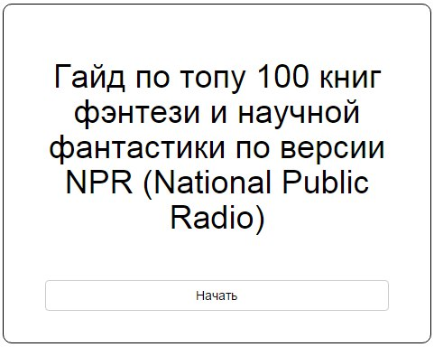

A russian version of interactive guide to NPR's list of top 100 science fiction and fantasy books

  

Do you love to read science fiction or fantasy? This guide help you to choose something on your preference.

## Why?

Just for fun! Inspired by [this article](http://bespoleznyi.ru/blog/2014-08-05-1921). I do not know at all what is National Public Radio:)

*Feel free to make pull requests!*

---

**Copyright © Gleb Kosteiko <gleb.kosteiko@gmail.com>**

This work is free. You can redistribute it and/or modify it under the
terms of the Do What The Fuck You Want To Public License, Version 2,
as published by Sam Hocevar. See the [COPYING](https://github.com/gleb-kosteiko/top-100-fantasy-scifi-books/blob/master/copying.txt) file for more details.
